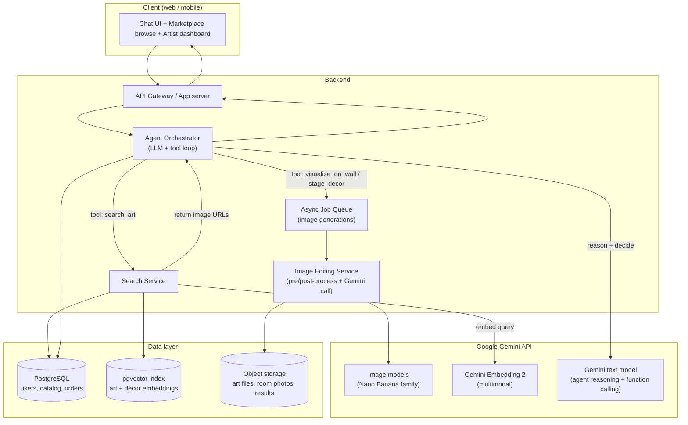

# System Design Report — "Art Visualizer & Product Search" Agent

A complete, build-it-by-hand guide for an agent that helps customers see real catalog
artworks and décor items placed on their own walls and tables, and that searches your
art database by style — built on the Gemini API.

> This document is written so you can understand and build every piece yourself. It
> explains *why* each choice is made, not just *what* to do, and it links to the
> primary documentation you should read for each part.

---

## 1. What you are actually building (clarified)

You have a marketplace where **artists upload and sell their art and home‑décor items**.
On top of that marketplace you want an **agent** that a customer can chat with. The agent
should be able to:

1. **Search the catalog by style** ("show me minimalist abstract pieces in blue") and
   show matching artwork images directly in the chat.
2. **Take a photo of the customer's wall** and show that wall with a *real* artwork from
   your database placed on it, looking natural and matched to the room.
3. **Take a photo of a table / empty surface** and place décor items from your database
   on it.
4. Do all of this conversationally — recommend, refine, swap pieces, change placement.

So the agent has two core jobs: **retrieval** (find the right product in your database)
and **visualization** (show that product in the customer's space). Everything below is
organized around those two jobs.

---

## 2. The single most important design decision

**You are placing *real products you sell*, not generating new art.**

This sounds obvious, but it changes the whole architecture. Many people reach for a
text-to-image model and ask it to "imagine art on this wall." That produces a *fake*
artwork that nobody can buy. On a selling platform the customer must see **the actual
piece** (the exact image the artist uploaded), because that is what ships to them.

That means your visualization step is **image *editing* / compositing**, not
text-to-image generation. You give the model two inputs — the customer's room photo and
the exact catalog image — and ask it to combine them. There are two ways to do this, and
the right answer is usually a blend:

| Approach | How it works | Pros | Cons |
|---|---|---|---|
| **A. Generative compositing** (AI image editing) | Send the wall photo + the artwork image to an image-editing model and ask it to place the art, matching lighting, perspective, shadows. | Photorealistic, handles angles/lighting automatically, easy to build. | Can subtly alter the artwork's colors/details; must be labelled "preview, not exact." |
| **B. Deterministic compositing** (classic computer vision) | Detect the wall plane and a frame region, perspective-warp the *exact* artwork pixels into it, blend edges. | Pixel-faithful to the real product. Cheap, fast, no per-image AI cost. | Less photorealistic; struggles with odd angles, complex lighting, soft furnishings. |

**Recommended:** Start with **A (generative)** because it is dramatically faster to build
and looks great, and Gemini's image-editing models are specifically good at "place this
product into this scene." Always show it to the customer as an **AI visualization /
preview**, and keep the unmodified catalog image available as the source of truth. Later,
if fidelity complaints appear, add **B** for the framed-art case (a flat rectangle on a
flat wall is exactly where deterministic warping shines).

This one decision (edit real products, label it as a preview) protects you legally and
sets customer expectations correctly.

---

## 3. High-level architecture



### Component responsibilities

- **Frontend** — three surfaces sharing one design system: the chat agent, the normal
  marketplace browse/buy flow, and the artist upload dashboard.
- **API / App server** — authentication, request validation, talks to the agent, serves
  catalog data, handles checkout. This is your trust boundary; the Gemini API key lives
  here, never in the browser.
- **Agent orchestrator** — the brain. Runs the *tool-calling loop* (Section 4). It does
  not do search or image editing itself; it *decides* which tool to call and stitches the
  results into a conversation.
- **Search service** — turns a customer's words (and optionally their room photo) into
  catalog results using vector + metadata search.
- **Image editing service** — wraps the Gemini image API with the pre/post-processing
  your product needs (resize, validate, watermark/label, store result).
- **Async job queue** — image generation takes seconds and costs money. Never block the
  web request on it. Enqueue, return a "generating…" state, push the result when ready.
- **Data layer** — PostgreSQL for relational data, the `pgvector` extension in the same
  database for embeddings (no separate vector DB needed at your scale), and object
  storage (S3 / Google Cloud Storage / Cloudflare R2) for all image files.

---

## 4. How the agent actually works (no vibe-coding — the real mechanics)

An "agent" is not magic. It is a **loop** around a language model that can call your
functions. Build this loop yourself once; you'll understand every agent framework
afterward.

The loop:

1. You send the model: the **system prompt** (its instructions + persona), the
   **conversation so far**, and a list of **tool definitions** (name, description, input
   schema) — this is "function calling."
2. The model replies with either (a) normal text for the user, or (b) a structured
   request to call one of your tools with specific arguments.
3. If it asks for a tool, **your code runs that tool** (e.g. query the database), and you
   send the **tool result** back into the model.
4. The model continues — maybe calling another tool, maybe answering. Repeat until it
   produces a final text answer.

In pseudocode:

```python
messages = [system_prompt, ...history, user_message]
while True:
    response = gemini.generate(messages, tools=TOOLS)   # the model decides
    if response.has_function_call:
        result = run_tool(response.function_call)        # YOUR code runs
        messages.append(response)                        # model's request
        messages.append(tool_result(result))             # your answer
        continue                                         # loop again
    else:
        return response.text                             # final answer to user
```

That `while` loop *is* the agent. Frameworks (LangGraph, Google's Agent Development Kit,
Vertex AI Agent Engine) just add memory, retries, parallel tool calls, and observability
on top of it. **Build the raw loop first; adopt a framework only when you feel the pain
it solves.**

### Your tools (the functions the agent can call)

Define each with a clear description (the model reads these to decide when to use them):

- `search_art(query, style?, color?, price_max?, room_type?, limit)` → returns a list of
  catalog items (id, title, artist, price, thumbnail URL). Backed by the search service.
- `visualize_on_wall(room_image_id, artwork_id, placement_hint?)` → enqueues an image
  edit and returns a job id / result URL. Backed by the image service.
- `stage_decor(surface_image_id, decor_item_ids[], arrangement_hint?)` → same idea for
  tables/shelves.
- `analyze_room(room_image_id)` → (optional but powerful) asks a Gemini vision model to
  describe the wall colour, lighting, existing style, and approximate dimensions. Feed
  that into `search_art` so recommendations actually match the room.
- `get_item_details(artwork_id)` → full product info for "tell me more / add to cart."

The chain that makes your product feel smart: **`analyze_room` → `search_art` →
`visualize_on_wall`.** The agent looks at the room, finds matching real products, and
shows them on the wall — all in one conversation.

---

## 5. Retrieval: searching the catalog by style

Keyword search ("blue abstract") is weak for art because style is visual and fuzzy. Use
**semantic / vector search**:

1. When an artist uploads a piece, generate an **embedding** of the image (and of its
   title/description/tags) — a list of numbers capturing its meaning. Store it in
   `pgvector`.
2. When a customer searches, embed their **text query** (or their room photo) into the
   same vector space and find the **nearest** artwork vectors. Combine with normal SQL
   filters (price, size, availability) — this is "hybrid search."

Because the customer might search by words *or* by a photo of their room, you want a
**multimodal** embedding model so text and images live in one shared space. As of mid-2026
**Gemini Embedding 2** does exactly this — text, images, and more mapped into a single
3,072-dimension space, so "search images with a sentence" works out of the box and you
avoid stitching together separate text and image encoders (the older CLIP approach). It
plugs directly into PostgreSQL + `pgvector`.

Practical notes:
- Store both an **image embedding** and a **text-metadata embedding** per item; you can
  search either or blend them.
- Use metadata filters in SQL *before or alongside* the vector search so you never show
  sold-out or out-of-budget items.
- Cache popular query embeddings.

---

## 6. Visualization: placing the art / décor

This is the image-editing service. The flow:

1. Customer uploads a wall/table photo → store in object storage, get an id.
2. Agent calls `visualize_on_wall(room_image_id, artwork_id, ...)`.
3. Service fetches both images, optionally runs `analyze_room` for context, and calls the
   Gemini image-editing model with **both images as input** plus a precise instruction.
4. Result is stored, watermarked/labelled as an AI preview, and the URL is returned.

The Gemini image models (the "Nano Banana" family) are well-matched to this because they
do **conversational multi-image editing**: you can pass a room photo plus product
reference image(s) and ask the model to compose them while preserving perspective and
lighting. The Pro tier accepts many reference images and is built for "stage this room
using photos of these specific items" type tasks — which is precisely your use case.

Prompt-design tips that matter a lot here:
- Be explicit and physical: *"Place the artwork from image 2 centered on the main wall in
  image 1, at realistic scale for a sofa wall, matching the room's lighting and casting a
  soft natural shadow. Do not alter the artwork's colors or composition. Keep everything
  else in the room unchanged."*
- One change at a time. To swap a piece, edit again rather than redoing from scratch.
- Watch for **warped straight lines / altered colours** — frame edges and the artwork
  itself are where generative models drift. Inspect, and consider the deterministic
  fallback (Section 2-B) for framed rectangular pieces.
- Outputs carry an invisible **SynthID watermark**; that's fine and even helpful for
  disclosure, but know it's there.

Always show the result labelled **"AI visualization — actual artwork may vary slightly,"**
and keep the original catalog image one tap away.

---

## 7. Is the Gemini API a good choice here? (Direct answer: yes)

For *this* project Gemini is an unusually clean fit because **all three capabilities you
need live in one ecosystem with one SDK and one key:**

- **Image editing / compositing** → Nano Banana family (multi-image, virtual-staging /
  product-placement is a first-class use case).
- **Multimodal search** → Gemini Embedding 2 (text + image in one vector space).
- **Agent reasoning + function calling** → Gemini text models drive the tool loop.

That means less integration glue, one billing relationship, and consistent docs.

**Cost snapshot (verify before launch — these change):** the cheaper image models run
roughly in the few-cents-per-image range, the Pro image model is more (low double-digit
cents per image at higher resolution), and there's a generous free tier in Google AI
Studio (~500 image requests/day) for prototyping. Embeddings are cheap (fractions of a
cent per query). Budget the **image edits** as your main variable cost — every "show me
on my wall" is a paid generation.

**Honest caveats:**
- **Fidelity risk** — generative editing can nudge the artwork's colours/details. This is
  the central tension of a *selling* platform; handle it with the "preview" framing and
  the deterministic fallback.
- **Watermark** — SynthID is embedded in outputs.
- **Latency & cost** — seconds per image and real money per call → the async queue and
  caching aren't optional, they're core.
- **Vendor lock-in** — building entirely on one provider is convenient but couples you to
  their pricing/availability. Keep your image-editing and embedding calls behind your own
  interface so you *could* swap providers later.

**Alternatives worth knowing** (so the choice is informed, not default): for image
editing, other strong editing/compositing models exist and many teams keep one as a
fallback; for embeddings, open CLIP-style models can run self-hosted to cut per-query
cost; for the agent layer, the loop is provider-agnostic. None of these change the
architecture — only which box you call inside the image/embedding/LLM services.

---

## 8. Suggested tech stack (learnable, not trendy)

Nothing here is mandatory — these are choices that are well-documented and good to learn on.

- **Frontend:** Next.js (React) + Tailwind. One framework for marketplace + chat.
- **Backend:** Python (FastAPI) — best ecosystem for AI/embeddings and the cleanest
  Gemini SDK examples — *or* Node.js if you prefer one language across the stack.
- **Database:** PostgreSQL + the `pgvector` extension (relational data and vectors in one
  place). Managed Postgres (Supabase, Neon, Cloud SQL) is fine.
- **Object storage:** Google Cloud Storage / AWS S3 / Cloudflare R2.
- **Queue:** Redis + a worker (RQ / Celery / BullMQ) for async image jobs.
- **Auth:** a hosted provider (Clerk / Auth0 / Supabase Auth) so you don't hand-roll
  passwords. Three roles: artist, customer, admin.
- **AI:** Google `google-genai` SDK for images, embeddings, and the agent.

---

## 9. Data model sketch

```
users(id, role[artist|customer|admin], name, email, …)
artists(user_id, bio, payout_info, …)
artworks(id, artist_id, title, description, price, dimensions,
         category[art|decor], style_tags[], image_object_key, status, created_at)
artwork_embeddings(artwork_id, image_vector vector(3072), text_vector vector(3072))
room_uploads(id, user_id, image_object_key, analysis_json, created_at)
generations(id, user_id, type[wall|table], room_upload_id, artwork_ids[],
            result_object_key, status[queued|done|failed], cost, created_at)
orders(id, customer_id, artwork_id, price, status, created_at)
chat_sessions(id, user_id, messages_json, created_at)
```

The `generations` table is also your **cost ledger** and your cache key — if the same
room + same artwork is requested again, return the stored result instead of paying twice.

---

## 10. Build it in phases (so you actually finish)

1. **Marketplace MVP, no AI.** Artists upload art; customers browse and buy. Get auth,
   DB, storage, and payments working. *This is the foundation — don't skip it.*
2. **Semantic search.** Generate embeddings on upload; build `search_art`; add a search
   bar. No chat yet.
3. **The agent loop.** Implement the raw tool-calling loop with just `search_art`. Make
   the chat show product images. This teaches you the agent before any image generation.
4. **Wall visualization.** Add the image service + async queue + `visualize_on_wall`.
   Start with a few clean, well-lit test rooms.
5. **Room analysis + table décor.** Add `analyze_room` (smarter recommendations) and
   `stage_decor`.
6. **Polish:** caching, cost dashboards, the "AI preview" labelling, the deterministic
   fallback for framed pieces, evaluation.

Ship each phase before starting the next. Phase 3 is where it starts to feel like an
agent; phase 4 is where it starts to feel like magic.

---

## 11. Risks & responsibilities (don't leave these to the end)

- **Accurate representation.** Always label generative results as previews and keep the
  true catalog image accessible. Misrepresenting a product you sell is a real legal risk.
- **Artist rights & consent.** Make artists agree (at upload) that you may display and
  AI-composite their work for previews. Their art is their IP.
- **AI disclosure.** Tell users when an image is AI-generated/edited; the SynthID
  watermark supports this.
- **Cost control.** Per-user rate limits, caching, and an admin cost dashboard. Image
  generation is your runaway-spend risk.
- **Content safety & moderation.** Moderate uploaded room photos and artist submissions.
- **Privacy.** Room photos are personal. State retention clearly; let users delete them.
- **Latency UX.** Optimistic "generating your preview…" states, never a frozen spinner on
  a blocked request.

---

## 12. Documentation & learning resources

Primary docs (read these first — they are the source of truth and stay current):

- Gemini image generation & editing ("Nano Banana"):
  https://ai.google.dev/gemini-api/docs/image-generation
- Gemini embeddings (incl. multimodal Gemini Embedding 2):
  https://ai.google.dev/gemini-api/docs/embeddings
- Gemini function calling (the basis of your agent loop):
  https://ai.google.dev/gemini-api/docs/function-calling
- Image understanding / vision (for `analyze_room`):
  https://ai.google.dev/gemini-api/docs/image-understanding
- Google AI Studio (free prototyping, API keys): https://aistudio.google.com
- Pricing (check before launch): https://ai.google.dev/gemini-api/docs/pricing

Building blocks:

- `pgvector` (vector search in Postgres): https://github.com/pgvector/pgvector
- Embeddings + pgvector walkthrough:
  https://dev.to/googleai/a-guide-to-embeddings-and-pgvector-df0
- FastAPI: https://fastapi.tiangolo.com  ·  Next.js: https://nextjs.org/learn

Concepts to study (search these terms):

- "retrieval-augmented generation" and "hybrid search" (vector + keyword)
- "image inpainting" and "perspective transform / homography" (for the deterministic
  fallback in Section 2-B; OpenCV is the library)
- "LLM agent tool-calling loop" (then "LangGraph" / "Google Agent Development Kit" once
  the raw loop makes sense)

---

## 13. One-paragraph summary

Build a normal marketplace first. Add multimodal semantic search so customers can find
art by style. Wrap a hand-written tool-calling loop around a Gemini text model and give it
three tools — search the catalog, visualize a real artwork on a wall photo, and stage
décor on a surface — using Gemini's image-*editing* models (not text-to-image) so the
customer always sees the actual product they can buy. Treat every generated image as a
labelled preview, run generations asynchronously through a queue, and watch your per-image
costs. Gemini is a strong, coherent choice because image editing, multimodal embeddings,
and agent function-calling all live in one API.
